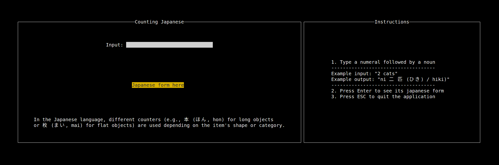

# counting-japanese.hs



- Build:

``` shell
stack build
```

- Run:

``` shell
stack exec counting-japanese
```

- Run tests:

``` shell
stack test
```

## Useful links:

- All of the featured projects: [https://github.com/jtdaugherty/brick](https://github.com/jtdaugherty/brick)
- Hspec: [https://github.com/hspec/hspec-example/tree/main](https://github.com/hspec/hspec-example/tree/main)
- Debugging and testing in Haskell: [https://haskell.dev/article/Debugging_and_testing_in_Haskell_Tips_and_tricks.html](https://haskell.dev/article/Debugging_and_testing_in_Haskell_Tips_and_tricks.html)
- Stack getting started: [https://docs.haskellstack.org/en/stable/tutorial/hello_world_example/](https://docs.haskellstack.org/en/stable/tutorial/hello_world_example/)
